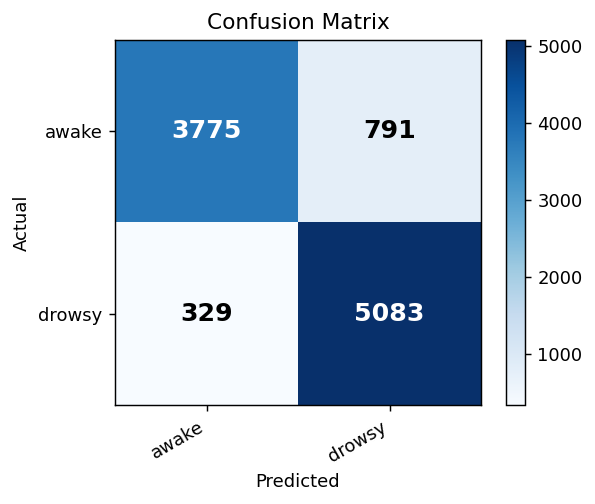
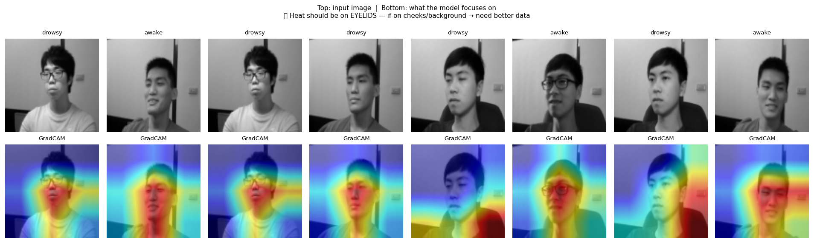
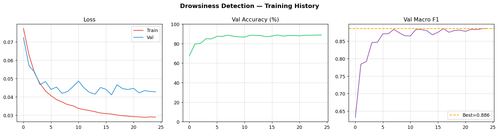

# 🚗 Driver Drowsiness Detection System

A professional, real-time dual-mode driver drowsiness detection system designed to prevent accidents by monitoring driver alertness.

This project utilizes a custom-trained **EfficientNet-B0** model for image-based drowsiness classification, paired with **MediaPipe FaceMesh** for precise Eye Aspect Ratio (EAR) calculations.

---

## 🔥 Features

* **Dual-Mode Detection**: Combines Deep Learning (EfficientNet-B0) and facial landmark geometry (EAR) for robust performance.
* **Auto-Calibration**: Automatically measures your personal baseline "open eye" state for highly accurate thresholds.
* **Car Dashboard GUI**: Premium OpenCV-based dashboard with real-time stats and alerts (`src/drowsiness_demo.py`).
* **Web Interface**: Lightweight browser-based version using MediaPipe (`src/drowsiness_web.html`).
* **Audio Alerts**: Triggers visual + sound alerts when drowsiness is detected.

---

## 🛠 Installation

```bash
git clone https://github.com/T4igo/Driver-drowsiness-detection.git
cd Driver-drowsiness-detection
```

```bash
python -m venv .venv
source .venv/bin/activate   # Windows: .venv\Scripts\activate
```

```bash
pip install -r requirements.txt
```

---

## 🚀 Usage

### 1. Professional Dashboard (Python)

```bash
python src/drowsiness_demo.py
```

**Flags:**

* `--source 1` : Use different webcam
* `--model_threshold 0.40` : Adjust sensitivity
* `--no_calibration` : Skip calibration

---

### 2. Inference Script

```bash
python src/drowsiness_inference.py
```

**Flags:**

* `--ear_threshold 0.22`
* `--alert 1.5`

---

### 3. Web Application

```bash
python -m http.server
```

Open:

```
http://localhost:8000/src/drowsiness_web.html
```

---

## 📊 Results

### Confusion Matrix



### Grad-CAM Visualization



### Training Curves



---

## 🧠 How it Works

1. **Eye Aspect Ratio (EAR)**
   Uses MediaPipe facial landmarks to compute eye openness.

2. **EfficientNet-B0 Model**
   Face region is extracted and passed through a trained deep learning model.

3. **Decision Logic**
   Combines EAR + model predictions over time to detect sustained drowsiness.

4. **Alert System**
   Triggers audio and visual alerts when thresholds are exceeded.

---

## 📁 Project Structure

```
Driver-Drowsiness-Detection/
│
├── src/
│   ├── drowsiness_demo.py
│   ├── drowsiness_inference.py
│   └── drowsiness_web.html
│
├── models/
│   └── model_config.json
│
├── outputs/
│   ├── confusion_matrix.png
│   ├── gradcam.png
│   └── training_curves.png
│
├── requirements.txt
├── README.md
└── LICENSE
```

---

## 🎯 Future Improvements

* Mobile app integration
* Edge deployment (Raspberry Pi)
* Larger dataset for improved accuracy
* Cloud-based monitoring

---

## 📜 License

This project is licensed under the MIT License.
